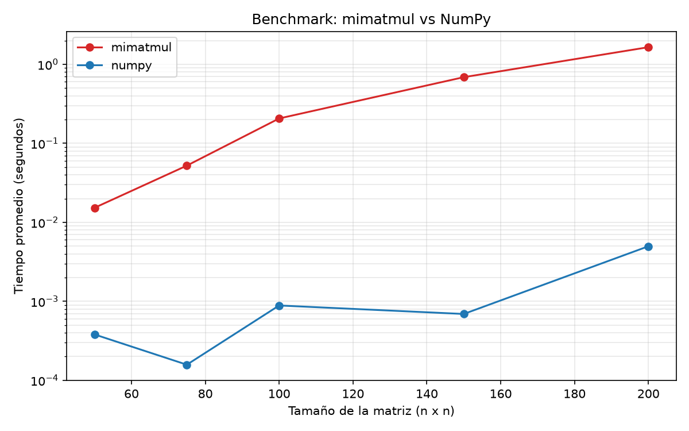

# Proyecto 0 — Benchmarking con Python y OpenCode

## Descripción

Proyecto 0 del curso: prepara el ambiente de trabajo, investiga las
características del computador e implementa una multiplicación de matrices
con ciclos explícitos de Python (`mimatmul`) para compararla con la
operación optimizada de NumPy mediante un benchmark reproducible.

El repositorio contiene:

- `src/system_info.py`: obtiene las características del computador.
- `src/mimatmul.py`: multiplicación de matrices con ciclos de Python.
- `src/benchmark.py`: compara `mimatmul` con `A @ B` de NumPy.
- `tests/test_mimatmul.py`: pruebas automáticas de `mimatmul`.
- `data/system_info.json`: características reales del computador.
- `data/benchmark_results.csv`: mediciones reales del benchmark.
- `figures/benchmark.png`: gráfico de tiempos por método.

## Instalación

Requisitos: Python 3.14, Git y una cuenta de GitHub.

Descargar el repositorio:

```
git clone https://github.com/Josefaloyolao/P0-loyola-josefa
cd P0-loyola-josefa
```

Crear el ambiente virtual:

```
python -m venv venv
```

Activarlo (Windows):

```
venv\Scripts\activate
```

Instalar las dependencias:

```
pip install -r requirements.txt
```

## Ejecución

Ejecutar las pruebas:

```
python -m pytest
```

Obtener información del computador:

```
python src/system_info.py
```

Ejecutar el benchmark (genera el CSV y el gráfico):

```
python src/benchmark.py
```

## Computador

Las características se obtienen con `src/system_info.py` y se guardan en
`data/system_info.json`.

| Característica | Valor |
|---|---|
| Sistema operativo | Windows 11 (10.0.26200) |
| Arquitectura | AMD64 |
| Python | 3.14.3 |
| NumPy | 2.5.1 |
| Procesador | 12th Gen Intel Core i5-1235U |
| Núcleos físicos | 10 |
| Procesadores lógicos | 12 |
| RAM total | ~8.3 GB |
| RAM disponible (al medir) | ~441 MB |
| GPU | Intel UHD Graphics |
| Disco total / libre | 510 GB / ~252 GB |

## Resultados



El benchmark midió matrices cuadradas float64 de tamaños 50, 75, 100, 150
y 200, con 3 repeticiones por método (5 tamaños × 2 métodos × 3
repeticiones = 30 mediciones). Se usó `time.perf_counter` y una ejecución
de calentamiento previa. Los datos están en
`data/benchmark_results.csv`. El gráfico muestra el promedio por tamaño en
escala logarítmica, necesaria porque los tiempos difieren ~1000× entre
ambos métodos.

Comportamiento observado: `mimatmul` crece de forma mucho más abrupta que
NumPy. Por ejemplo, con n=200 `mimatmul` tarda ~1.05 s mientras que NumPy
tarda ~0.001 s, una diferencia de aproximadamente 1000 veces. La curva de
`mimatmul` crece casi con el cubo del tamaño (O(n³)), como corresponde a
tres ciclos anidados.

## Observaciones de rendimiento

- **¿`mimatmul` utiliza uno o varios núcleos?** Uno. Es un único hilo de
  Python ejecutando ciclos anidados; durante la corrida observada el
  proceso usó en promedio ~80% y como máximo ~100% de un núcleo (sobre 12
  núcleos lógicos).

- **¿NumPy utiliza uno o varios núcleos?** En estas matrices pequeñas,
  NumPy también se mantuvo alrededor de un núcleo. NumPy delega la
  multiplicación en bibliotecas compiladas (BLAS) que pueden usar varios
  hilos, pero con matrices de este tamaño el trabajo es tan pequeño que
  no se aprovechan varios núcleos.

- **¿Por qué NumPy es más rápido?** Porque el trabajo pesado lo hace
  código compilado en C/Fortran (BLAS) optimizado para el hardware, sin
  interpretar cada operación como hace Python. El intérprete de Python
  agrega un costo enorme por cada suma y multiplicación.

- **¿Por qué las repeticiones no entregan exactamente el mismo tiempo?**
  Por la planificación del sistema operativo, la carga de otros procesos,
  la memoria disponible (que era escasa al medir, ~441 MB libres) y las
  variaciones del reloj del procesador. Se observó, por ejemplo, que
  NumPy con n=150 varió entre ~0.0005 s y ~0.004 s.

- **¿Cuál es la mayor matriz cuadrada que cabría en la RAM libre?**
  Multiplicar A·B requiere en memoria las matrices A, B y el resultado C.
  Con float64 (8 bytes por elemento) y ~400 MB utilizables, se cumple
  3 × 8 × n² ≤ 400 MB, es decir n ≈ 4000. Una matriz de 4000×4000 cabría
  en la RAM libre, pero `mimatmul` necesitaría un tiempo inaceptable
  (n³ = 6.4 × 10^10 operaciones), por lo que el benchmark usa tamaños
  pequeños y seguros.

## Uso de OpenCode

*Sección de reflexión personal. Revisar y ajustar antes de entregar.*

- **¿Qué parte realizó correctamente el agente?** La configuración del
  ambiente (venv, dependencias), la estructura del repositorio, la
  implementación de `mimatmul`, las pruebas, el benchmark con CSV y
  gráfico, y la documentación.
- **¿Qué parte tuvo que corregir o modificar?** El nombre del procesador
  en `system_info.py` (se mejoró usando `wmic`), un commit que quedó sin
  incluir `system_info.py`, la simplificación de una línea del benchmark y
  la forma de observar el uso de CPU (el proceso de Python lanzaba un
  proceso hijo).
- **¿Qué archivo comprendo mejor?** `src/mimatmul.py`, porque es la
  función más corta y directa del proyecto.
- **¿Qué parte todavía me resulta menos clara?** La medición fina de
  tiempos y la escala logarítmica del gráfico, así como las llamadas de
  bajo nivel (`ctypes`/`wmic`) de `system_info.py`.

## Estado

Proyecto completo y verificado: 6 pruebas aprobadas, benchmark ejecutado
con datos reales, gráfico generado y documentación finalizada.
